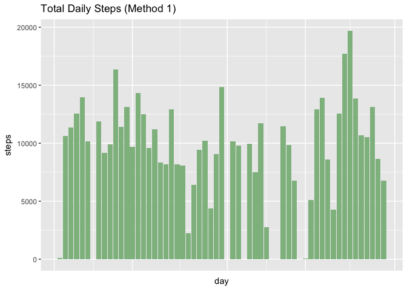
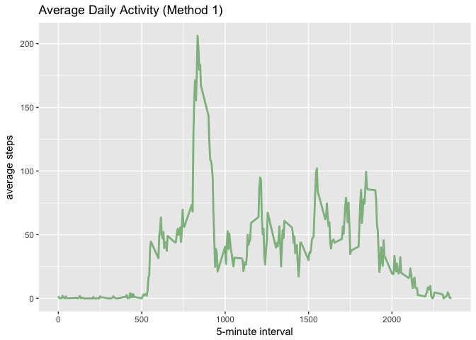
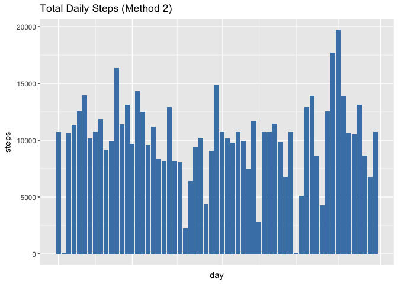
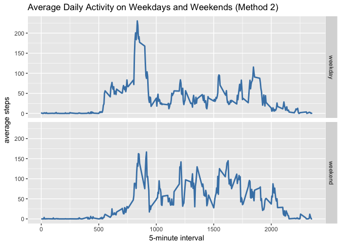
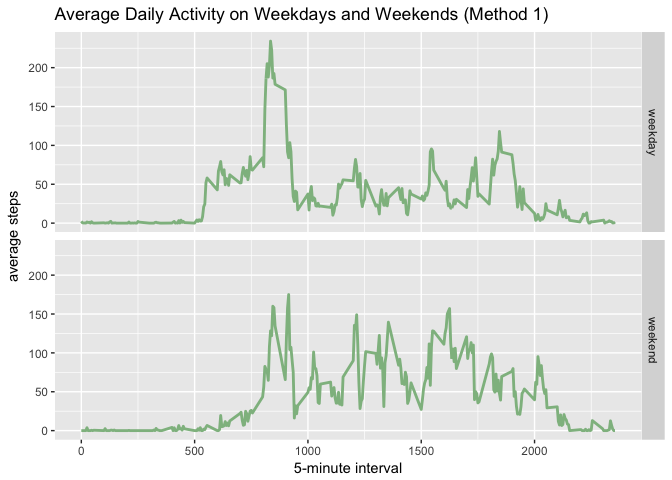

# Reproducible Research: Peer Assessment 1

# Personal Activity Monitoring

This a report of personal activity monitoring data collected from a device that tracks the number of steps walked during a day. It records the activity in 5 minute intervals. The data is from one anonymous individual from a two month period in the fall of 2012. The report is an assignment for Data Science Course 5. The purpose is to try to find patterns in the data, and evaluate what should be done to the missing values in the data.


## Loading and preprocessing the data


Following libraries are used in the analysis.

```r
library(tidyverse)
library(lubridate)
library(knitr)
```

The data for the project is assumed to be in a file named "activity.csv" in the working directory. If the file is still zipped, the script will first unzip the file, and then read it.


```r
if(!file.exists("activity.csv")){
  unzip("./activity.zip")}
data0<-read.csv("./activity.csv")
str<-str(data0)
```

The file has three variables.  

    1. steps - number of steps measured  
    2. date - the day of the measurement  
    3. interval - the 5 minute interval of the measurement during the day

There are some missing values in the data set, that will be dealt with two different methods  

    Method 1 - just omitting the missing values from data  
    Method 2 - replacing missing values with interval means  
The methods and their impact will be discussed more further.

The date variable is converted to date in preprocessing.

```r
data0$date<-ymd(data0$date)
```


## What is mean total number of steps taken per day?


#### Method 1 - Missing values omitted

In the first analysis, the missing values in the data are just omitted. 

```r
odata<-na.omit(data0)
```

Average number of steps taken each day is 10766 steps.  The median of daily total steps is 10765. 

```r
means1<-odata %>%
    group_by(date) %>%
    summarise(dailytotal=sum(steps)) %>%
    summarise(mean(dailytotal),median(dailytotal))
kable(means1, align = "l")
```


mean(dailytotal)   median(dailytotal) 
-----------------  -------------------
10766.19           10765              


The variation between days in the data is clearly visible. There are days with 0 steps measured, and on the most active day the number of total steps reaches close to 20000.


```r
g<-ggplot(odata,aes(date,steps))
g+geom_histogram(stat="sum",na.rm=TRUE,fill="darkseagreen")+
  labs(title="Total Daily Steps (Method 1)",x="day")+
  theme(legend.position="none",
        axis.text.x = element_blank(),
        axis.ticks.x = element_blank())
```

<!-- -->

## What is the average daily activity pattern?


The average daily activity pattern has even more variation, but also an understandable shape. The first intervals measured in the day fall presumably to the early hours, and have constantly very low activity. The most active intervals are in the morning. On the average, activity during the day rises and falls until it starts in the evening to fade out to the midnight.


```r
idata<-odata %>%
  group_by(interval) %>%
  summarise(averagesteps=mean(steps))

g<-ggplot(idata,aes(interval,averagesteps))
g+geom_line(col="darkseagreen",lwd=1)+
  labs(title="Average Daily Activity (Method 1)",x="5-minute interval",y="average steps")
```

<!-- -->

The 5-minute interval with highest number of daily average steps is interval 835. During this time of day 206 steps are taken on the average.


```r
maxint<-idata[which.max(idata$averagesteps),]
kable(maxint, align = "l")
```


interval   averagesteps 
---------  -------------
835        206.1698     

## Imputing missing values

There are a total of 2304 rows of missing values in the data set. 

```r
table(is.na(data0$steps))
```

```

FALSE  TRUE 
15264  2304 
```


There is no data for certain dates at all. In total 8 days in the data set have no measured data. The rest of the data for the other 53 days contains no missing values. The dates have intervals with zero measured activity, but that is a measurement, not missing data.


#### Method 2 - Imputing missing values with interval means

Missing values in the data set are imputed with the means of steps in each interval across all days, since the missing values are from whole days. The missing 8 days of data are replaced by average daily activity patterns.


```r
imdata<-data0 %>%
  group_by(interval) %>%
  mutate(steps= replace(steps, is.na(steps), mean(steps, na.rm=TRUE)))
```

The difference in the estimates between method 1 (omitting NA's) and method 2 (replacing NA's with interval means) is small. The mean of daily total steps is not affected by this method of imputing interval means. The median of daily total steps rises only by 1.2 steps. 


```r
means2<-imdata %>%
  group_by(date) %>%
  summarise(dailytotal=sum(steps)) %>%
  summarise(mean(dailytotal),median(dailytotal))
compmeans<-rbind.data.frame(means1,means2)
compmeans<-rownames_to_column(compmeans,var="method")
kable(compmeans, align = "l")
```


method   mean(dailytotal)   median(dailytotal) 
-------  -----------------  -------------------
1        10766.19           10765.00           
2        10766.19           10766.19           


The biggest impact in the changing of method, is on the histogram of total daily steps. With the previous method, there were 8 days more in the histogram, that looked liked days of zero activity. They are now replaced by the average. The average daily activity pattern would still look identical with both methods.


```r
g<-ggplot(imdata,aes(date,steps))
g+geom_histogram(stat="sum",fill="steelblue")+
  labs(title="Total Daily Steps (Method 2)",x="day")+
  theme(legend.position="none",
        axis.text.x = element_blank(),
        axis.ticks.x = element_blank())
```

<!-- -->


## Are there differences in activity patterns between weekdays and weekends?

To answer the question, a new variable is added to the data. 

```r
wdata<-  mutate(imdata, weekday=wday(date), label=FALSE)
defweekdays <- 2:6
wdata$weekday <- factor((wdata$weekday %in% defweekdays), 
                        levels=c(TRUE, FALSE), 
                        labels=c('weekday', 'weekend'))
```

There is a clear difference in activity patterns between weekdays and weekends. During the weekend, activity starts later and the big morning peak is missing. Activity is also more evenly distributed throughout the day on weekends, and it also lasts a bit later. The early hours after midnight are very inactive both on weekdays and weekends.


```r
wwtable<-wdata %>%
  group_by(interval,weekday) %>%
  summarise(averagesteps=mean(steps))
g<-ggplot(wwtable,aes(interval,averagesteps))
g+geom_line(col="steelblue",lwd=1)+
  facet_grid(weekday ~ .)+
  labs(title="Average Daily Activity on Weekdays and Weekends (Method 2)",
       x="5-minute interval",
       y="average steps")
```

<!-- -->

The data set used in the weekday/weekend comparison above is the one where missing values were replaced by interval means (method 2). This slightly evens out the difference between different types of days. But the shape of the daily activity pattern hardly alters between the two methods. Method 1 of just omitting the missing values would have produced very similar patterns.

<!-- -->


